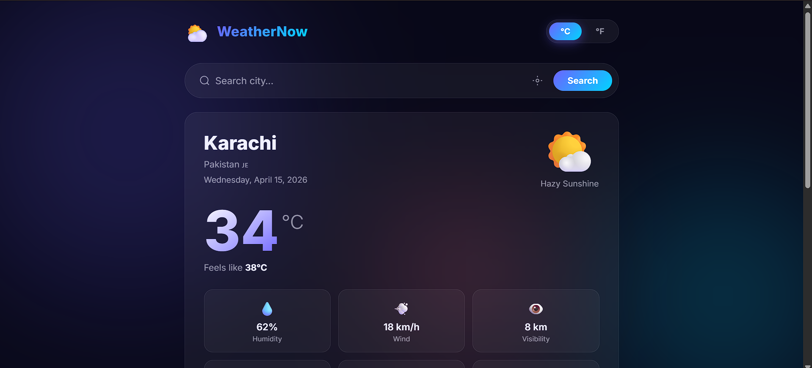

<h1 align="center">🌤️ WeatherNow</h1>

<p align="center">
  <strong>A beautifully designed, real-time weather dashboard with a dark glassmorphism UI.</strong><br/>
  Search any city worldwide, auto-detect your location, and view live weather conditions at a glance.
</p>

<p align="center">
  
  
  
  
  
</p>

---

## 📸 Screenshots

### 🏠 Homepage — Live Weather Dashboard (Karachi, °C)
> The app auto-loads Karachi weather on startup in demo mode. Shows temperature, weather icon, humidity, wind speed, visibility and more — all inside a sleek dark glassmorphism card with animated background orbs.



---

### 🔁 Temperature Unit Switch — Fahrenheit Mode
> One click on the °F toggle instantly converts all temperatures. Here Karachi's 34°C becomes 93°F, feels like 100°F — with all 6 stat cards (Humidity, Wind, Visibility, Pressure, Sunrise, Sunset) fully visible.


---

## ✨ Features

| Feature | Description |
|---|---|
| 🌡️ Current Weather | Temp, feels like, humidity, wind, visibility, pressure |
| 📅 5-Day Forecast | Daily high/low with animated weather icons |
| 📍 Geolocation | Auto-detect current location with one click |
| 🔍 City Search | Search any city with live suggestion dropdown |
| 🔄 °C / °F Toggle | Switch temperature units instantly — no reload |
| 🎨 Glassmorphism UI | Dark theme with animated gradient background orbs |
| 🚀 Demo Mode | Works out of the box — no API key needed |
| 📱 Responsive | Fully optimized for both mobile and desktop |

---

## 🏙️ Demo Cities Available

> In demo mode, try these cities from the quick-pick pills:

`Karachi` · `Lahore` · `London` · `New York` · `Tokyo` · `Dubai`

---

## 🔑 Enable Live Weather Data

1. Get a **free API key** at [openweathermap.org](https://openweathermap.org/api)
2. Open `script.js`
3. Replace `YOUR_API_KEY_HERE` with your key and set `DEMO_MODE = false`

```js
const API_KEY   = 'your_actual_key_here';
const DEMO_MODE = false;
```

---

## 🛠️ Tech Stack

| Technology | Purpose |
|---|---|
| HTML5 | Semantic structure & accessibility |
| CSS3 | Glassmorphism styling, blob animations, responsive grid |
| JavaScript ES6+ | Weather logic, API calls, geolocation, unit conversion |
| OpenWeatherMap API | Live weather + 5-day forecast data |

---

## 📁 Project Structure

```
weathernow-app/
├── index.html        # App structure
├── style.css         # Dark glassmorphism theme
├── script.js         # Weather logic, demo data & API integration
└── Screenshots/
    ├── HOMEPAGE.png
    └── SWITCH_TO _FRENHITE.png
```

---

## 🚀 Getting Started

```bash
# Clone the repo
git clone https://github.com/qasim-safi/weathernow-app.git
cd weathernow-app

# Open in browser — no build tools needed
open index.html
```

---

## 👨‍💻 Developer

**Qasim Safi** — BS Software Engineering Student  
🌐 Django Web Dev | 📱 Flutter App Dev | 🐍 Python & Java

[](https://github.com/qasim-safi)

---

## 📄 License

MIT License — free to use, modify, and distribute.
